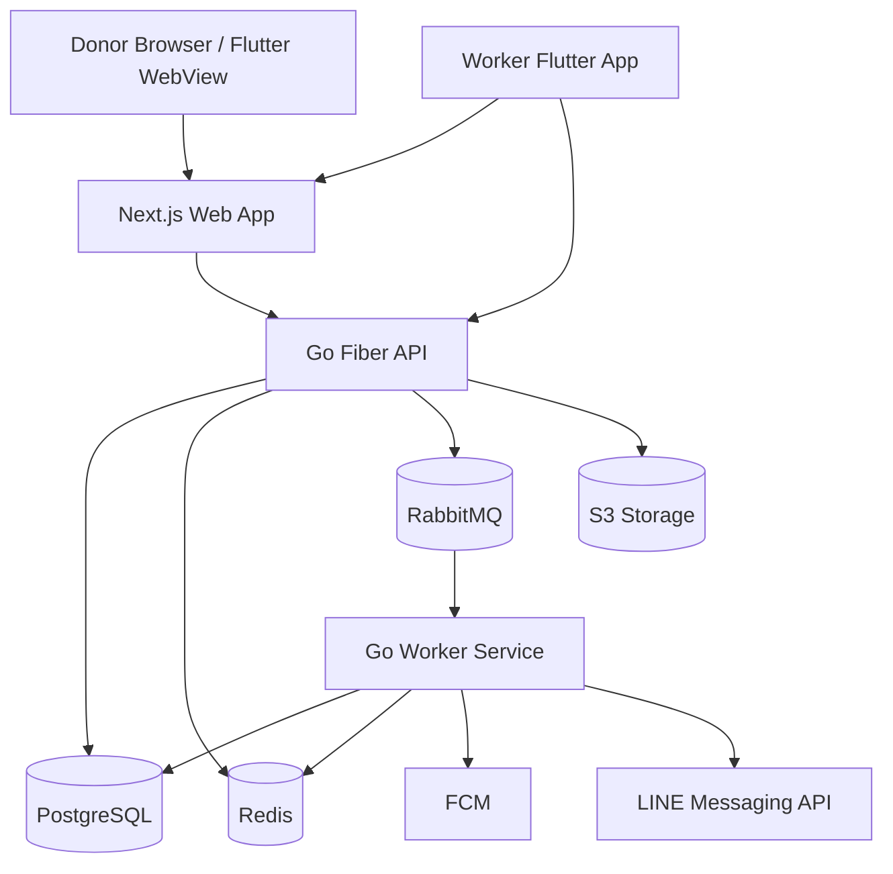

# TipDrop Architecture

## Overview
TipDrop is a direct PromptPay tipping platform. Workers receive 100% of tips. The platform does not hold funds; it only tracks tip requests, uploaded slips, worker confirmation, notifications, and leaderboard data.

## Runtime Components

## Responsibility Boundaries

### Flutter
- Native shell
- Auth token storage
- Push notification registration
- QR scanner
- WebView host
- Optional native worker dashboard

### Next.js
- Public worker profile
- Donor tip flow
- PromptPay QR display
- Slip upload UI
- Donor status polling
- WebView-compatible worker dashboard screens

### Go Fiber API
- Authentication
- Authorization
- Tip status machine
- Worker/profile APIs
- S3 signed upload
- Queue publishing
- Rate limiting

### Worker Service
- RabbitMQ consumers
- Notification delivery
- Tip expiry cron
- Leaderboard cache refresh
- Retry/dead-letter handling

## Non-Negotiable Rules
1. No wallet table for MVP.
2. No platform-held balance.
3. Confirmed totals are derived from `tip_requests` where `status = confirmed`.
4. Worker can only confirm/dispute their own tip requests.
5. All slip images must use signed upload flow.
