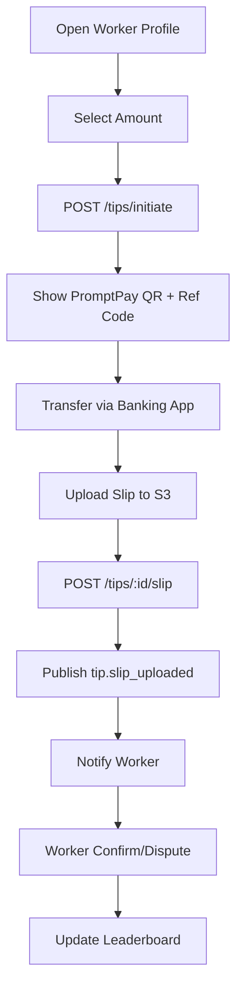

# Tip Flow

```mermaid
flowchart TD
  A[Open Worker Profile] --> B[Select Amount]
  B --> C[POST /tips/initiate]
  C --> D[Show PromptPay QR + Ref Code]
  D --> E[Transfer via Banking App]
  E --> F[Upload Slip to S3]
  F --> G[POST /tips/:id/slip]
  G --> H[Publish tip.slip_uploaded]
  H --> I[Notify Worker]
  I --> J[Worker Confirm/Dispute]
  J --> K[Update Leaderboard]
```
